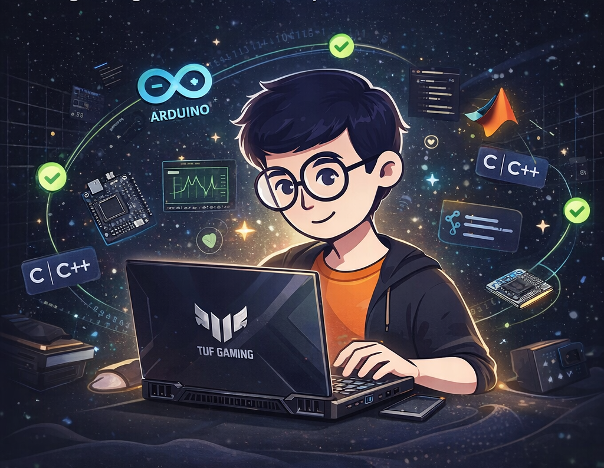

<h1 align="center">Hi 👋, I'm Abhishek Ahirrao</h1>
<h3 align="center">Engineering Student from Nashik, driven to learn, build, and grow 🚀</h3>

  

---

  

---

  <b>
  I am an ambitious engineering student from Nashik, currently pursuing B.Tech in Electronics & Telecommunication at KK Wagh Institute of Engineering Education & Research.  
  I am passionate about building real-world engineering solutions and continuously improving my technical and problem-solving skills.
  </b>

---

## 🚀 About Me

- 🎓 B.Tech (Electronics & Telecommunication Engineering)  
- 📍 Nashik, Maharashtra  
- 📊 CGPA: 8.64 / 10  
- 🎯 Career Goal: Embedded Systems | VLSI | Core Engineering  
- 📈 Strong interest in simulation, embedded systems, and system design  

---

## 🌱 My Journey

I started my engineering journey with a strong focus on understanding core electronics and problem-solving.  
Over time, I moved towards hands-on learning by building projects, working with simulation tools, and exploring embedded systems.

Being part of **Team Antariiksh (Avionics & Flight Computer)** helped me gain exposure to real-world engineering systems, simulation-based analysis, and teamwork in technical environments.

Through continuous learning and participation in competitions, I achieved national-level recognition and developed a mindset of building impactful solutions.

---

## 🏆 Achievements

- 🥇 Smart India Hackathon (SIH) 2025 Winner (MathWorks Problem Statement)  
- 📊 87.51 Percentile in JEE Mains  
- 📄 Research Publication – ICITSC 2025  
- 💼 Winter Internship – Bharat Space Education Research Centre  
- 🎓 Strong academic performance with consistent growth  

---

## 💼 Experience

### 🚀 Team Antariiksh – Avionics & Flight Computer
- Worked on simulation-assisted avionics system analysis  
- Contributed to embedded system validation  
- Gained practical exposure to system-level engineering  

### 💼 Winter Intern – BSERC
- Developed **Water Rocket Optimization Model**  
- Optimized parameters like water fill % and pressure using simulation  
- Tools used: MATLAB, Simulink, OpenRocket  

---

## 💻 Projects

### 🔹 FPGA Image Deduplication Engine
- Designed RTL-based system for detecting duplicate images  
- Implemented using Verilog and simulation tools  

### 🔹 Water Rocket Optimization
- Built simulation model for optimizing rocket parameters  
- Visualized performance using MATLAB & Simulink  

### 🔹 Smart Home Automation System
- Designed mobile-controlled system using ESP32  
- Controlled real-world electrical loads remotely  

### 🔹 Traffic Simulation System
- Developed realistic traffic simulation models  
- Used MATLAB, RoadRunner, and Driving Scenario Designer  

---

## ⚙️ Technical Skills

### 👨‍💻 Programming
C • C++ • Embedded C • MATLAB  

### 🛠️ Tools & Technologies
MATLAB • Simulink • Xilinx Vivado • ModelSim • Arduino IDE • Proteus • Wokwi  

### 🔌 Hardware & Platforms
Arduino • ESP32 • Sensors • Embedded Systems  

---

## 🌟 Non-Technical Skills

- Leadership & Teamwork  
- Problem-Solving  
- Communication  
- Analytical Thinking  
- Time Management  

---

## 🧰 Tech Stack

  

  
  
  
  

---

## 📊 GitHub Stats

  

  

---

## 📈 Contribution Activity

  

---

## 🌐 Connect With Me

  
  
  

---

## ⚡ Personal Side

- 🏏 Cricket Enthusiast (Inspired by Virat Kohli)  
- 📚 Passionate about learning new technologies  
- 💡 Interested in solving real-world engineering problems  

---

## 🔥 Final Note

  <b>"Focused on growth, driven by curiosity, and committed to building impactful engineering solutions."</b>

---
