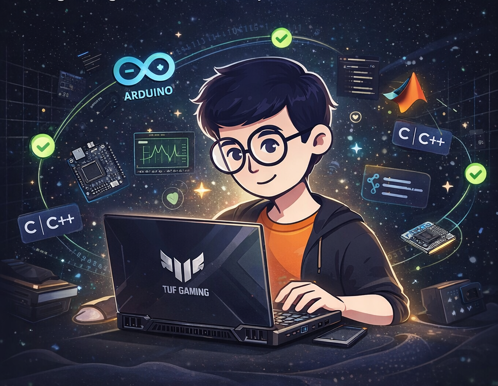

<h1 align="center">Hi 👋, I'm Abhishek Ahirrao</h1>

<h3 align="center">
Electronics & Telecommunication Engineering Student • Embedded Systems • ADAS • Simulation • FPGA
</h3>

<p align="center">
  <a href="https://github.com/Abhishek3m4">
    
  </a>
  <a href="https://github.com/Abhishek3m4?tab=followers">
    
  </a>
</p>

<p align="center">
  
</p>

---

<p align="center">
  
</p>

---

## 👨‍💻 About Me

> **E&TC engineering student and Smart India Hackathon'25 National Winner who turns system requirements into reliable, working firmware.**

I work at the intersection of **Embedded Systems, Automotive Simulation, ADAS, Avionics, FPGA/RTL Design and AI/ML**.

My approach is to understand a system from **sensor input → processing → control → validation**, using both hardware and simulation environments.

🎓 **B.Tech Electronics & Telecommunication Engineering**  
🏫 **K.K. Wagh Institute of Engineering Education & Research, Nashik**  
📊 **CGPA: 8.69 / 10 | Highest SGPA: 9.00 / 10**  
🏆 **Smart India Hackathon 2025 — National Winner | ₹1.5 Lakh Award**  
🏆 **Unplugged Hardware Hackathon 2026 — 1st Prize | ₹25K Award**  
🎯 **Career Focus: Embedded Systems • VLSI • Core Engineering**

---

## 🧭 Engineering Focus

<p align="center">
  
  
  
  
</p>

<p align="center">
  
  
  
  
</p>

---

## 🏆 Highlights

<table align="center">
<tr>

<td align="center" width="200">
<h2>🥇</h2>
<b>SIH 2025</b><br>
National Winner
</td>

<td align="center" width="200">
<h2>🏆</h2>
<b>Hardware Hackathon 2026</b><br>
1st Prize
</td>

<td align="center" width="200">
<h2>🚀</h2>
<b>Team Antariksh</b><br>
Avionics & Flight Computer
</td>

<td align="center" width="200">
<h2>📄</h2>
<b>Research</b><br>
2 Peer-Reviewed Publications
</td>

</tr>
</table>

---

# 🚀 Featured Projects

## 🚗 V2V-Enabled ADAS Hardware-in-the-Loop Vehicle Simulator

**B.Tech Project | Feb 2026 – Present**

<p align="center">
  
  
  
  
  
</p>

Developing a **hardware-in-the-loop vehicle simulation and control platform** for ADAS and V2V validation.

### Key Features

- 🚘 Adaptive Cruise Control **(ACC)**
- 🛑 Automatic Emergency Braking **(AEB)**
- 📡 V2V communication
- 🎮 Steering wheel, accelerator and brake pedal integration
- 🧠 Jetson Orin Nano + ESP32 real-time control
- 🔬 MATLAB/Simulink + RoadRunner simulation
- ⚙️ Hardware-in-the-loop testing

---

## 🌐 TwinX — Indian Traffic Digital Twin & Simulation Platform

**Smart India Hackathon 2025 | MathWorks PS 25100**

<p align="center">
  
  
  
  
</p>

Developed an automation platform for generating **Indian road traffic simulation scenarios**.

### ⚡ Performance

<table align="center">
<tr>
<th>Parameter</th>
<th>Result</th>
</tr>

<tr>
<td>Scenario Setup</td>
<td><b>30 min → ~9 min</b></td>
</tr>

<tr>
<td>OSM Parsing</td>
<td><b>~3–5 sec</b></td>
</tr>

<tr>
<td>AI Code Generation</td>
<td><b>~8–10 sec</b></td>
</tr>

<tr>
<td>Asset Conversion</td>
<td><b>~8–12 sec</b></td>
</tr>

<tr>
<td>Reproducibility</td>
<td><b>~93%</b></td>
</tr>

</table>

Implemented configurable Indian driving behaviours with parameterized vehicle movement and scenario generation.

<p align="center">
  <b>🏆 Smart India Hackathon 2025 — National Winner</b>
</p>

---

## 🛰️ GaganiX — Space Weather Radiation Forecasting System

**ISRO Bhartiya Antariksh Hackathon 2026**

<p align="center">
  
  
  
  
  
</p>

Led ML and data-processing work using **11 years of satellite radiation and solar-wind datasets**.

### 📊 Forecasting Performance

<table align="center">
<tr>
<th>Forecast Horizon</th>
<th>Accuracy</th>
</tr>

<tr>
<td>30 Minutes</td>
<td><b>~92%</b></td>
</tr>

<tr>
<td>6 Hours</td>
<td><b>~82%</b></td>
</tr>

<tr>
<td>12 Hours</td>
<td><b>~76%</b></td>
</tr>

</table>

**Radiation Event Detection:** ~88% accuracy  
**Inference Latency:** ~120 ms

---

## 🧠 FPGA Image Reconstruction & Deduplication Engine

**First Prize — Unplugged Hardware Hackathon 2026**

<p align="center">
  
  
  
  
</p>

Built a pipelined **8-bit grayscale image-processing chain**.

```text
Input Image
     ↓
Median Filter
     ↓
Gaussian Filter
     ↓
Bilateral Filter
     ↓
Spatial Kalman Filter
     ↓
aHash Signature
     ↓
Hamming Distance
     ↓
Duplicate Detection
